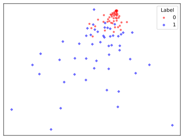
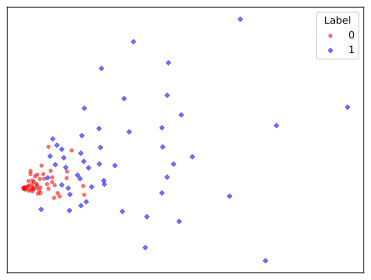
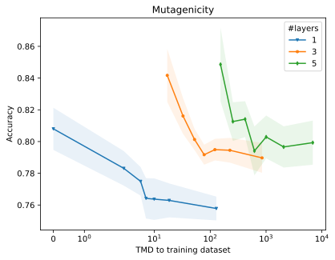

# When Does More Expressivity Hurt Generalization?
---
- [Experiments](#experiments)
    - [Median-Based Labeling with Cycle Counts](#median-based-labeling-with-cycle-counts)
    - [MDS-Based Labeling via TMD Distances](#mds-based-labeling-via-tmd-distances)
    - [Real-World Datasets](#real-world-datasets)

## Experiments

### Median-Based Labeling with Cycle Counts
We generate 3,000 random graphs. For each graph, we count the number of cycles of length 3 and 4. Then, we compare these counts to the median across all graphs in the dataset. If the count is below the median, we assign a label of 0; otherwise, we assign a label of 1.

To reproduce the experiment, run
```bash
python synthetic.py --dataset er --task sum_basis_C4 --pe basis_C4
```
For the explanation on the arguments, please run
```bash
python synthetic.py --help
```

The images below show a 2-dimensional embedding of graphs using Multidimensional Scaling (MDS) based on the pairwise Tree Mover's Distances for the first 100 Erdős–Rényi graphs.
<center>



</center>
The leftmost plot represents embeddings without positional encoding. The middle plot incorporates cycle counts of length 3, while the rightmost plot includes cycle counts of length 3 and 4. As more structural information - which is correlated to the graph labels - is added, the separation between classes becomes more distinct. This trend is reflected in model performance, which improves from 84.80% (no encoding) to 86.57% (cycle counts of length 3) and 97.93% (cycle counts of length 3 and 4).

---

### MDS-Based Labeling via TMD Distances
We generate 500 random graphs. We compute the pairwise Tree Mover's distances on the graphs equipped with counts of cycles of length up to 5. Labels are assigned using a clustering algorithm on a 2-dimensional embedding of the dataset.
```bash
python synthetic.py --dataset er --task tmd --pe basis_C5 --num_graphs 500
```

---

### Real-World Datasets
We employ some molecular dataset from ``TUDataset`` and plot the performance w.r.t. the Tree Mover's distance to the training dataset.
```bash
python real.py --dataset Mutagenicity --num_layers 3
```

| Performance | Error bound |
|:-------------------------:|:-------------------------:|
|| |
|  |   |
|  |   |
|  |   |
|  |    |
|  |   |

As reported, performance deteriorates as the testing samples get further from the training dataset. The effect is less pronounced in PROTEINS: for this dataset, methods that neglect the graph structure outperform graph-based approaches; hence, the graph structure is not crucial for the classification task.